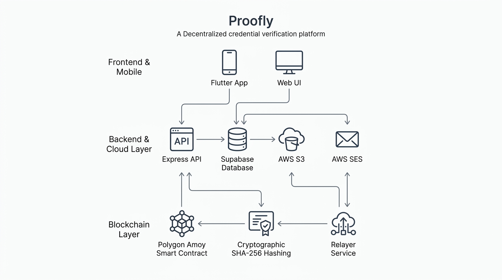

# 🛡️ Proofly

> **Decentralized Digital Credential Issuance, Verification & Management Platform**  
> *Anchored on the Polygon Blockchain with SHA-256 Cryptographic Proofs, Gasless Relayers, and Cross-Platform Flutter Mobile Wallet.*

---

[](https://proofly-api.vercel.app)
[](https://amoy.polygonscan.com/address/0xfb960EB42729f84C48040eBe264b11473d926006)
[](https://flutter.dev)
[](https://www.typescriptlang.org)
[](https://supabase.com)
[](https://soliditylang.org)

---

## 📑 Table of Contents
1. [Overview](#-overview)
2. [System Architecture](#-system-architecture)
3. [Key Features](#-key-features)
4. [Monorepo Structure](#-monorepo-structure)
5. [Smart Contract Details](#-smart-contract-details)
6. [Tech Stack](#-tech-stack)
7. [Getting Started (Local Development)](#-getting-started-local-development)
8. [Mobile App Setup](#-mobile-app-setup)
9. [Production Deployment](#-production-deployment)
10. [License](#-license)

---

## 🌟 Overview

**Proofly** solves the widespread problem of certificate fraud and paper-based credential verification. By anchoring verifiable credential fingerprints directly onto the **Polygon Amoy Testnet** through Solidity smart contracts, Proofly allows universities, enterprises, and certification bodies to issue tamper-proof certificates that anyone can verify instantly via web or mobile — **without requiring users to own crypto or pay gas fees**.

---

## 🏛️ System Architecture



### 🔄 End-to-End Verification Lifecycle

```text
 ┌─────────────────┐       ┌─────────────────┐       ┌──────────────────────┐
 │   Organization  │ ───►  │  Express API    │ ───►  │  Polygon Smart       │
 │   (Issuer Web)  │       │  & Relayer Svc  │       │  Contract (Registry) │
 └─────────────────┘       └────────┬────────┘       └──────────────────────┘
                                    │
                         ┌──────────┴──────────┐
                         ▼                     ▼
               ┌──────────────────┐   ┌──────────────────┐
               │  Supabase        │   │  AWS SES / S3    │
               │  Postgres DB     │   │  Email & Storage │
               └──────────────────┘   └────────┬─────────┘
                                               │
                                               ▼
                                      ┌──────────────────┐
                                      │  Recipient       │
                                      │  (Flutter App)   │
                                      └────────┬─────────┘
                                               │
                                               ▼
                                      ┌──────────────────┐
                                      │  Public Verifier │
                                      │  (Web / QR Scan) │
                                      └──────────────────┘
```

---

## ✨ Key Features

- **⛓️ On-Chain Proofs on Polygon**: Every issued credential is authenticated with its unique SHA-256 hash directly on the `CertificateRegistry` smart contract.
- **⚡ Gasless Relayer Mechanism**: Backend transaction sponsor ensures non-crypto users can issue and receive credentials with **0 gas fees**.
- **🔍 Multi-Mode Instant Verification**:
  - **Certificate ID / Hash Search**: Live query against smart contract state.
  - **Drag & Drop PDF Verification**: Instant client-side cryptographic hashing matches against blockchain registry in <100ms.
  - **Mobile QR Code Scanning**: Camera-based cryptographic verification on the mobile app.
- **📱 Cross-Platform Mobile Wallet (Flutter)**:
  - Offline certificate vault with AES-encrypted local storage.
  - High-res PDF download and social sharing.
  - Organization verification badges.
- **📧 Automated Email Claim Flows**: AWS SES-powered claim invitations delivering 1-click tokenized links to recipients.
- **📄 Vector Certificate Generation Engine**: Dynamic generation of high-quality PDF certificates with embedded QR codes and signatures.

---

## 📂 Monorepo Structure

```text
Proofly/
├── api/                    # Vercel Serverless Function entry point
├── apps/
│   └── mobile/             # Flutter cross-platform mobile app (Android/iOS)
│       ├── lib/            # Dart source (Providers, Models, Screens, Widgets)
│       └── assets/         # App icons, vectors & branding
├── packages/
│   ├── contracts/          # Hardhat Solidity smart contracts & deployment scripts
│   │   └── contracts/      # CertificateRegistry.sol
│   └── shared/             # Shared TypeScript schemas, DTOs & Zod validators
├── services/
│   └── api/                # Express.js REST API & Web UI static portal
│       ├── public/         # Light-themed Web application (HTML/CSS/JS/SVG)
│       └── src/
│           ├── modules/    # Auth, Organizations, Certificates, Claims, Verification
│           ├── services/   # Blockchain, S3, SES Email, PDF Generation
│           └── config/     # Environment, Supabase & Web3 configs
├── infrastructure/         # Supabase PostgreSQL migrations & schemas
├── assets/                 # Architecture diagrams & documentation assets
└── vercel.json             # Vercel cloud deployment configuration
```

---

## ⛓️ Smart Contract Details

- **Contract Name**: `CertificateRegistry.sol`
- **Network**: **Polygon Amoy Testnet (Chain ID: 80002)**
- **Contract Address**: [`0xfb960EB42729f84C48040eBe264b11473d926006`](https://amoy.polygonscan.com/address/0xfb960EB42729f84C48040eBe264b11473d926006)
- **Explorer**: [PolygonScan Amoy](https://amoy.polygonscan.com/address/0xfb960EB42729f84C48040eBe264b11473d926006)

---

## 💻 Tech Stack

| Layer | Technologies |
| :--- | :--- |
| **Blockchain** | Solidity 0.8.24, Hardhat, Ethers.js v6, Polygon Amoy |
| **Backend API** | Node.js 20, Express, TypeScript, Zod, JWT |
| **Database & Auth** | Supabase (PostgreSQL, Row-Level Security) |
| **Cloud Services** | AWS S3 (Storage), AWS SES (Transactional Email) |
| **Frontend Web** | HTML5, Vanilla CSS3, JavaScript (ES6+), SVG Vectors |
| **Mobile App** | Flutter 3.x, Dart, Provider / State Management |
| **Hosting & CI/CD** | Vercel (Serverless Functions & Global Edge CDN) |

---

## 🚀 Getting Started (Local Development)

### 1. Prerequisites
- **Node.js** >= 20.x
- **npm** >= 10.x
- **Flutter SDK** >= 3.22.x
- **Git**

### 2. Clone and Install Dependencies
```bash
git clone https://github.com/atharvabaodhankar/Proofly.git
cd Proofly
npm install
```

### 3. Configure Environment Variables
Copy `.env.example` to `.env` in the root directory (or in `services/api/.env`):
```ini
PORT=4000
NODE_ENV=development
API_BASE_URL=http://localhost:4000/api/v1
APP_URL=http://localhost:4000
JWT_SECRET=your_secret_jwt_key_here

# Supabase
SUPABASE_URL=https://your-project.supabase.co
SUPABASE_ANON_KEY=your_anon_key
SUPABASE_SERVICE_ROLE_KEY=your_service_role_key

# Polygon Amoy
CHAIN_ID=80002
NETWORK_NAME=polygon-amoy
POLYGON_AMOY_RPC_URL=https://polygon-amoy.g.alchemy.com/v2/YOUR_KEY
CONTRACT_ADDRESS=0xfb960EB42729f84C48040eBe264b11473d926006
RELAYER_PRIVATE_KEY=your_wallet_private_key

# AWS S3 & SES
STORAGE_PROVIDER=s3
AWS_REGION=ap-south-1
AWS_ACCESS_KEY_ID=your_aws_key
AWS_SECRET_ACCESS_KEY=your_aws_secret
AWS_S3_BUCKET=proofly-certificates
EMAIL_FROM=no-reply@yourdomain.com
```

### 4. Build Monorepo & Start API Server
```bash
# Compile contracts and TypeScript packages
npm run build

# Start local API server and Web UI (http://localhost:4000)
npm run dev:api
```

---

## 📱 Mobile App Setup

```bash
cd apps/mobile

# Fetch Flutter dependencies
flutter pub get

# Run on connected device / simulator
flutter run --dart-define=API_URL=http://localhost:4000/api/v1

# Build release APK
flutter build apk --release --dart-define=API_URL=https://proofly-api.vercel.app/api/v1
```

---

## 🌐 Production Deployment

The web app and API are pre-configured for 1-click deployment on **Vercel**:
- Simply connect this repository to [Vercel](https://vercel.com).
- Add the production environment variables in the Vercel dashboard.
- Vercel automatically deploys the static UI and serverless Express API.

---

## 📄 License

This project is licensed under the **ISC License**.
